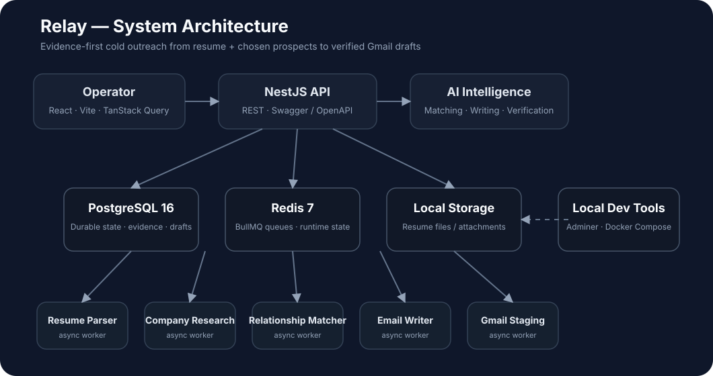
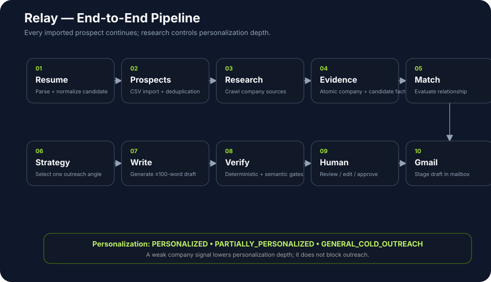
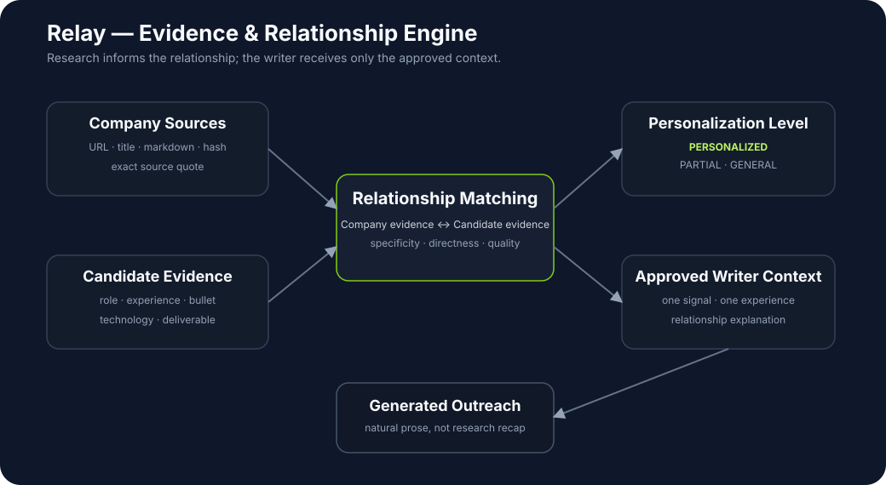
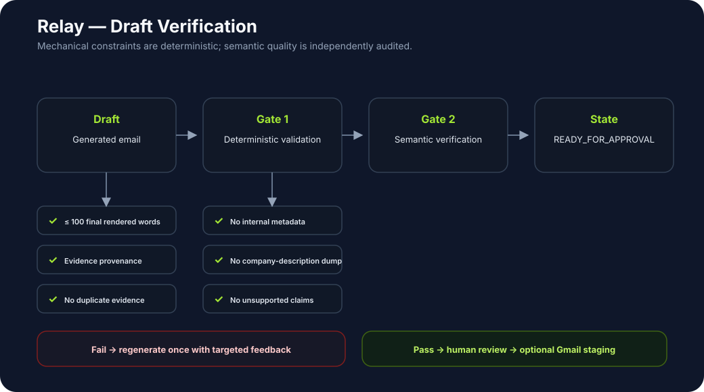
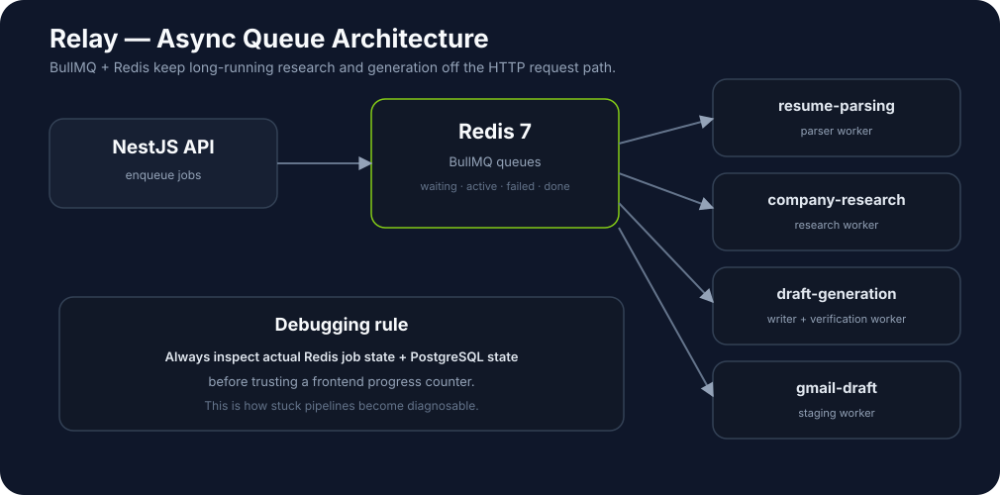
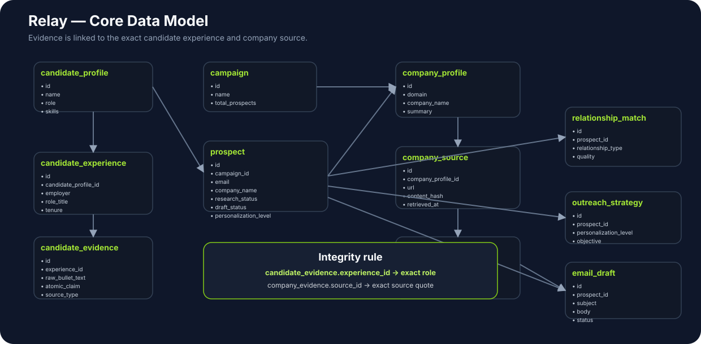

# Relay
https://drive.google.com/file/d/1riwZuSRhm4ExsaE2sX-IuFosntu7bVUs/view?usp=sharing

**AI-powered cold outreach for engineers and technical professionals.**

Relay turns a resume and an imported prospect list into researched, evidence-backed cold emails that are reviewed by a human before they become Gmail drafts.

> **Core product principle:** You decide who to contact. Relay decides how much the email can be personalized — from verified evidence.

Relay is **not** an auto-apply platform. It is built around starting conversations through cold email.

[](backend/) [](https://vitejs.dev/) [](https://www.postgresql.org/) [](https://docs.bullmq.io/)

---

## Table of Contents

- [What Relay Does](#what-relay-does)
- [Product Philosophy](#product-philosophy)
- [Architecture](#architecture)
- [Complete Pipeline](#complete-pipeline)
- [Core Features](#core-features)
- [AI Outreach Rules](#ai-outreach-rules)
- [Technology Stack](#technology-stack)
- [Repository Structure](#repository-structure)
- [Local Development](#local-development)
- [Environment Variables](#environment-variables)
- [Adminer](#adminer)
- [Swagger / OpenAPI](#swagger--openapi)
- [Database Debugging](#database-debugging)
- [Testing](#testing)
- [Security](#security)
- [Current Scope](#current-scope)

---

## What Relay Does

Relay accepts two primary inputs:

| Input | Description |
|---|---|
| **Resume** | The candidate's resume as a PDF/document |
| **Prospect CSV** | People the operator has already chosen to contact |

The platform turns those inputs into a structured workflow that combines resume parsing, company research, evidence extraction, relationship analysis, AI writing, independent verification, human review, and Gmail draft staging.

### High-level architecture



> **Design rule:** weak company research *reduces personalization depth* — it never prevents outreach.

---

## Product Philosophy

Relay is not a template generator. It is an **evidence-and-relationship engine that happens to produce cold emails**.

The system is intentionally split into four conceptual layers:

1. **Source facts** — facts that actually exist in the resume or company source.
2. **Normalized evidence** — structured representations of those facts.
3. **Relationship analysis** — Relay's assessment of how company and candidate evidence relate.
4. **Generated outreach** — natural language written for the recipient.

This separation prevents an LLM's own interpretation from silently becoming a source fact.

---

## Architecture

### End-to-End Pipeline



### Evidence & Relationship Engine



### Draft Verification



### Async Queue Architecture



### Core Data Model



---

## Complete Pipeline

| # | Stage |
|---:|---|
| 01 | Resume Upload |
| 02 | Resume Parsing |
| 03 | Candidate Profile Normalization |
| 04 | Candidate Experience / Evidence Extraction |
| 05 | Prospect CSV Import |
| 06 | Email Normalization + Deduplication |
| 07 | Company Identification |
| 08 | Company Web Research / Scraping |
| 09 | Company Source Persistence |
| 10 | Company Evidence Extraction |
| 11 | Candidate ↔ Company Relationship Matching |
| 12 | Personalization Level |
| 13 | Outreach Strategy |
| 14 | AI Email Generation |
| 15 | Deterministic Draft Validation |
| 16 | Independent Semantic Verification |
| 17 | `READY_FOR_APPROVAL` |
| 18 | Human Review / Edit / Approval |
| 19 | Gmail Draft Staging |

Every long-running stage is persisted or queued where appropriate, making backend state inspectable without relying on frontend counters.

---

## Core Features

### 1. Resume Upload and Parser

Relay parses the candidate's resume into **structured candidate intelligence** instead of repeatedly handing the complete resume to a model as an undifferentiated blob.

The normalized candidate model includes:

- Candidate identity, current role, and employer
- Previous employers and employment periods
- Candidate experiences and individual resume bullets
- Projects, technologies, and skills
- Achievements / activities

The important integrity rule is that candidate evidence is linked to a **specific experience**. Two positions at the same employer therefore remain distinct.

### 2. Prospect CSV Import

Prospects are imported in bulk from CSV. Email addresses are normalized before processing and deduplicated at multiple levels:

```text
CSV row
   │
   ├── Normalize email
   │
   ├── Duplicate in current file? ── yes → skip
   │
   ├── Already in database? ──────── yes → skip
   │
   ├── Already queued? ───────────── yes → skip
   │
   └────────────────────────────────────→ queue prospect
```

BullMQ job IDs are deterministic per campaign/email pair, which makes queue-level duplication observable and controllable.

### 3. Company Research and Scraping

Relay crawls publicly available company pages and turns retrieved content into structured company intelligence. The research layer records **provenance for every source**, rather than treating one generated company summary as ground truth.

Research signals can include:

- Products and initiatives
- Public engineering or architecture signals
- Technical workflows and platform capabilities
- Developer-facing products
- Business or product workflows
- Public hiring signals
- Technology / infrastructure clues

Every stored company source records its URL, title/section, HTTP status, content hash, retrieval timestamp, and content statistics.

Company evidence stores an `atomicClaim` plus a `verbatimQuote` that must be traceable back to the stored source content.

### 4. Candidate Intelligence

Candidate evidence is deliberately granular. Relay can select one relevant experience for one company and a different experience for another without merging roles.

Examples of evidence types include:

- Backend authorization / RBAC work
- Event-driven activity logging
- Redis caching and performance work
- Notification and workflow infrastructure
- Full-stack product ownership
- Distributed systems and observability projects

### 5. Relationship Matching

The matcher relates **company evidence** to **candidate evidence** instead of treating shared keywords as a sufficient match.

A useful relationship can be based on a concrete engineering concern, implementation pattern, workflow, architecture, or product capability. Merely sharing a technology such as PostgreSQL or AWS is not enough by itself.

The matcher produces structured relationship information such as:

- `relationshipType`
- `analyticalRationale`
- `directness`
- `relationshipQuality`
- personalization level

### 6. Personalization Levels

Every valid imported prospect continues through outreach generation. Personalization controls **depth**, not whether Relay generates outreach.

| Level | Meaning |
|---|---|
| `PERSONALIZED` | One concrete company signal connected to one concrete candidate experience |
| `PARTIALLY_PERSONALIZED` | A useful company signal connected to a broader candidate capability |
| `GENERAL_COLD_OUTREACH` | Company-specific research is weak; the writer uses only verified candidate facts and a normal cold introduction |

Weak research therefore produces a less personalized email, not a silent refusal.

### 7. Outreach Strategy

Before writing, Relay builds a compact strategy containing the approved context for the writer:

```text
Recipient
   +
Company Signal
   +
Candidate Evidence
   +
Relationship Explanation
   +
Outreach Objective
   ↓
Outreach Strategy
```

The writer does not need the entire company profile or entire resume to improvise its own relationship.

### 8. AI Email Writer

The writer receives a structured context containing only the information it is allowed to turn into prose, including:

```text
companyName
companySignal
companySourceQuote
candidateName
candidateEmployer
candidateRole
candidateExperience
candidateSourceBullet
relationshipExplanation
outreachObjective
recipientClass
personalizationLevel
```

The global rules are:

- **≤ 100 words** after final rendering
- Prefer one concrete company signal when research supports it
- Prefer one concrete candidate experience
- Explain the connection naturally instead of explaining the company
- Fall back to truthful cold outreach when research is weak
- Pull candidate facts from stored candidate evidence
- Never fabricate company or candidate facts
- Never invent familiarity with the recipient or company
- Never expose internal scoring, IDs, or research metadata

The goal is a credible reason to reply, not a summary of everything Relay learned.

### 9. Multiple Email Variants

Relay can generate multiple variants from the same approved relationship context so the operator can compare tone while keeping the same evidence, provenance, and word limit.

### 10. Deterministic Validation

Before human approval, code-level checks validate the final rendered email. Typical checks include:

- Final rendered word count ≤ 100
- Candidate evidence provenance exists
- Company provenance exists when personalized
- Duplicate evidence fragments are absent
- Internal IDs / scoring metadata are absent
- Unsupported evidence references are absent
- Company-description patterns are absent

### 11. Independent Semantic Verification

Deterministic rules catch mechanical failures. A separate verification model checks semantic quality:

- Does the draft communicate the intended company → candidate relationship?
- Is the connection specific rather than generic?
- Does it sound natural and peer-to-peer?
- Does it avoid pretend familiarity?
- Does it remain grounded in the selected evidence?

A failed verification can trigger one regeneration attempt with targeted feedback before the draft is blocked from human review.

### 12. Human Approval

Relay is **human-gated by default**.

```text
Generated
   ↓
Validated
   ↓
Verified
   ↓
READY_FOR_APPROVAL
   ↓
Human review / edit
   ├── Approve
   └── Reject / ignore
```

### 13. Gmail Integration

Approved outreach can be staged as Gmail drafts. Relay does not need to auto-send to provide its core value.

When configured, the candidate resume can be attached to the Gmail draft.

### 14. Queue-Based Processing

Relay uses **BullMQ + Redis** for long-running tasks:

- `resume-parsing`
- `company-research`
- `draft-generation`
- `gmail-draft`

This keeps the HTTP API responsive and makes pipeline execution observable.

---

## AI Outreach Rules

The following rules are global and company-agnostic:

### 1. One useful signal, not a research dump

When company research is strong, choose the single most useful company signal. Do not list industries, product categories, scraped keywords, or unrelated initiatives.

### 2. One concrete candidate experience

Prefer one specific deliverable that gives the recipient a reason to care. Do not concatenate several unrelated resume bullets.

### 3. Never explain the recipient's company back to them

Research is internal context. The final email should not read like a company profile.

### 4. Never manufacture the relationship

The email may simplify a verified relationship into natural language, but it must not invent why the candidate is relevant.

### 5. Weak research is still a valid cold email

When company research is insufficient, Relay uses truthful candidate facts and a normal cold introduction instead of fabricating personalization.

### 6. Candidate facts are dynamic

Candidate role, employer, technologies, projects, achievements, and experience details come from the candidate profile/evidence store. They are not hardcoded to a specific user.

### 7. The operator decides who to contact

Relay does not rank companies into “worthy” and “unworthy” prospects. Importing a prospect means the operator has already chosen to contact them.

### 8. The model is replaceable

Matching, writing, and verification models are independently configurable so the system can evolve without rewriting business logic.

---

## Technology Stack

| Layer | Technology |
|---|---|
| Backend | NestJS · TypeScript · TypeORM · REST APIs · Swagger/OpenAPI |
| Database | PostgreSQL 16 |
| Async processing | BullMQ · Redis 7 |
| Frontend | React · TypeScript · Vite · TanStack Query · React Router · Tailwind CSS |
| AI | Configurable text-model provider · matching · strategy · writing · semantic verification |
| Research | Public web crawling / scraping · source persistence · atomic evidence extraction |
| Email | Gmail integration · human-gated draft staging · resume attachment support |
| Infrastructure | Docker · Docker Compose · Adminer |
| Observability | AI request logging · Sentry where configured |

---

## Repository Structure

```text
Relay/
├── backend/
│   ├── src/
│   │   ├── config/
│   │   ├── database/
│   │   └── modules/
│   │       ├── campaigns/
│   │       ├── prospects/
│   │       ├── resume/
│   │       ├── company-research/
│   │       ├── outreach/
│   │       ├── queue/
│   │       ├── gmail/
│   │       └── health/
│   └── package.json
├── frontend/
│   ├── src/
│   │   ├── components/
│   │   ├── pages/
│   │   └── ...
│   └── package.json
├── docs/
│   └── assets/
│       ├── relay-architecture.svg
│       ├── relay-pipeline.svg
│       ├── relay-intelligence.svg
│       ├── relay-verification.svg
│       ├── relay-queues.svg
│       └── relay-data-model.svg
├── docker-compose*.yml
└── README.md
```

---

## Local Development

### Prerequisites

- Git
- Node.js + npm
- Docker Desktop

### Clone

```bash
git clone https://github.com/AshishRajx7/Relay.git
cd Relay
```

### Start infrastructure

```bash
docker compose up -d --build
```

If the repository uses a dedicated local Compose file, use that file instead.

### Backend

```bash
cd backend
npm install
npm run start:dev
```

API base path:

```text
/api/v1
```

### Frontend

```bash
cd frontend
npm install
npm run dev
```

---

## Environment Variables

A typical local configuration looks like:

```bash
DB_HOST=localhost
DB_PORT=5432
DB_USERNAME=relay
DB_PASSWORD=relay_dev_password
DB_DATABASE=relay

REDIS_HOST=127.0.0.1
REDIS_PORT=6380

AI_MODEL=
AI_MATCHING_MODEL=
AI_WRITING_MODEL=
AI_VERIFICATION_MODEL=
```

Depending on whether the application runs on the host or inside Docker, `DB_HOST` and Redis host values may use Compose service names instead. Gmail credentials and provider API keys belong only in local environment configuration.

---

## Adminer

Adminer is included as the local PostgreSQL browser / SQL console.

Open:

```text
http://localhost:8080
```

Useful SQL when debugging a campaign:

```sql
SELECT * FROM campaigns;

SELECT
  id, email, company_name, domain,
  research_status, draft_status, personalization_level
FROM prospects;

SELECT
  cp.domain,
  ce.category,
  ce.atomic_claim,
  ce.verbatim_quote
FROM company_evidence ce
JOIN company_profiles cp
  ON cp.id = ce.company_profile_id;

SELECT id, prospect_id, status, subject, body
FROM email_drafts;

SELECT
  email_draft_id, passed, severity,
  verifier_notes, cross_role_bleed_detected
FROM draft_verification;
```

When a pipeline counter looks wrong, compare the UI with these persisted rows.

---

## Swagger / OpenAPI

The NestJS backend exposes REST APIs through Swagger/OpenAPI. It is useful for:

- discovering available endpoints
- testing API calls without the frontend
- inspecting request/response schemas
- debugging upload, campaign, draft, approval, and Gmail flows

The API uses the `/api/v1` prefix. The exact Swagger route should be checked in the NestJS bootstrap/configuration for the current build.

---

## Database Debugging

Campaign overview is reporting data. The authoritative state is the persisted prospect/draft/research records.

### Campaign

```sql
SELECT id, name, total_prospects, completed_prospects, gmail_draft_count
FROM campaigns;
```

### Prospect

```sql
SELECT
  id, email, company_name, domain,
  research_status, draft_status, personalization_level
FROM prospects;
```

### Relationship

```sql
SELECT *
FROM relationship_match;
```

### Strategy

```sql
SELECT *
FROM outreach_strategy;
```

### Drafts

```sql
SELECT id, prospect_id, status, subject, body
FROM email_drafts;
```

### Verification

```sql
SELECT
  email_draft_id, passed, severity,
  verifier_notes, cross_role_bleed_detected
FROM draft_verification;
```

### Queue state

When a stage appears stuck, inspect actual BullMQ/Redis state (`waiting`, `active`, `completed`, `failed`, `delayed`) rather than assuming the frontend counter proves that a job ran.

---

## Testing

A clean end-to-end verification run should start from an empty runtime dataset: no candidate data, no prospects, no companies, no drafts, and no queued runtime jobs.

The flow under test is:

```text
Resume upload
    ↓
Resume parsing
    ↓
Candidate evidence
    ↓
Prospect CSV import
    ↓
Company research
    ↓
Relationship matching
    ↓
Outreach strategy
    ↓
AI email generation
    ↓
Deterministic validation
    ↓
Semantic verification
    ↓
READY_FOR_APPROVAL
    ↓
Human approval
    ↓
Gmail draft staging
```

### High-value invariants

- Every valid imported prospect progresses through outreach generation.
- Weak research produces `GENERAL_COLD_OUTREACH`, not an automatic refusal.
- Candidate claims are grounded in candidate data.
- Personalized company claims have source provenance.
- Final rendered emails are at most 100 words.
- Duplicate candidate evidence is not repeated.
- Internal metadata never appears in recipient-facing prose.
- Gmail staging happens only after the appropriate approval stage.
- Gmail draft counts equal actual staged records.
- Frontend counters match backend persisted state.

---

## Security

Relay handles resumes, contact information, company research, generated outreach, OAuth state, and AI provider credentials. Treat local development data accordingly.

**Never commit:**

- `.env` files containing secrets
- AI provider keys
- Gmail OAuth credentials
- private resumes or personal prospect exports
- database or Redis dumps
- scratch/debug scripts containing secrets

If a credential appears in a shell command, log, screenshot, or source file, rotate it before pushing the repository.

---

## Current Scope

Relay focuses on conversation-starting cold outreach:

```text
Choose prospects
      ↓
Research companies
      ↓
Understand candidate evidence
      ↓
Find a grounded outreach angle
      ↓
Write concise cold emails
      ↓
Verify
      ↓
Human approval
      ↓
Gmail drafts
```

Relay does **not** automate applications across external job boards.

---

## Design Principles

| Principle | Meaning |
|---|---|
| **You choose the prospects** | Relay does not decide who deserves contact. |
| **Personalization is a gradient** | Strong research enables stronger personalization; weak research falls back to truthful cold outreach. |
| **Evidence before prose** | The writer expresses an approved relationship instead of inventing one. |
| **Never fabricate** | No invented company facts, candidate experience, familiarity, achievements, or technical relationships. |
| **Human approval by default** | AI prepares the draft; the operator makes the final outreach decision. |
| **Provenance matters** | Company evidence links to source content; candidate evidence links to the exact experience. |
| **Backend state is authoritative** | UI counters reflect persisted state rather than driving workflow decisions. |
| **Models are replaceable** | Matching, writing, and verification models are independently configurable. |

---

## Final Product Idea

> Relay is not primarily an email template generator. It is an **evidence and relationship engine that happens to produce cold emails.**

**Repository:** https://github.com/AshishRajx7/Relay
